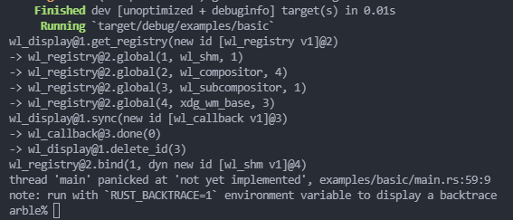
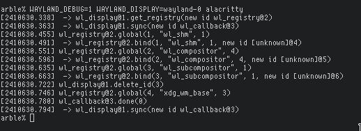

# Basic Wayland Compositor
This example shows the creation of a basic Wayland compositor.

# Running
This example can be run using `cargo run --example basic`. It will attempt to listen at `XDG_RUNTIME_DIR/wayland-0`. Applications can be told to connect to it by setting the `WAYLAND_DISPLAY` environment variable to `wayland-0`.

# Demonstration

First, the compositor is started. Note, most interface methods are stubs.

Then Alacritty connects to the compositor. With `WAYLAND_DEBUG=1`, the messages sent and received are displayed.